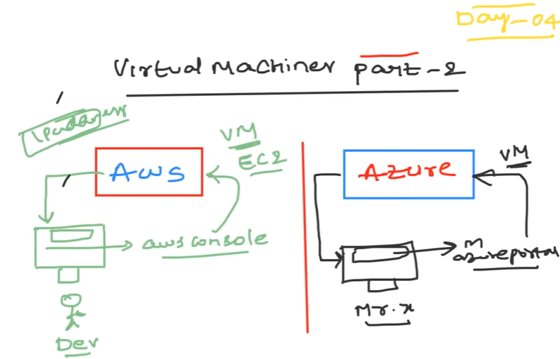
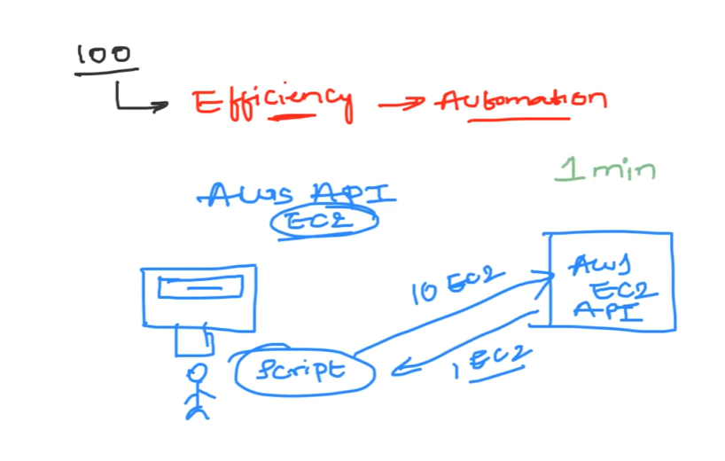

### Virtual Machines

- The main objective of the Devops Engineers is to improve the efficiency and use of all resources.

- In general, Dev teams used to built the applications in the local system and servers are the things they used to deploy their applications for clients

- To avoid the inefficiency the concept of virtualization comes into picture.

- Hypervisor is the software we install in the server to create the virtual machines and assign the each VM to the teams to increase the efficiency.

- VMware,Xen are some of the examples of Hypervisors

- In AWS VM is called as Ec2 instance.

### How to create virtual machines on AWS

- Manual process
- First user have to login to the aws console
- create the ec2 instance
- In return it will return the ip address and key credentials to us

- Automation process
- Devops engineers at amazon created an api for each ec2 instance
- if the requests are valid,authenticated and authorized properly we can get the ip address
- we can access those api by writing scripts
- those scripts can be written using
    - AWS CLI
    - AWS API (BOTO3- PYTHON MODULE)
    - AWS CFT
    - AWS CDK(cloud deployment kit)
    - terraform

## Creating an EC2 instance in AWS
- create an account with AWS
- Go to services
- select EC2
- Go to the instances
- Launch instance
- Provide the name of the instance
- Select the server(ubuntu)
- Choose the free Tier Instance type
- then create the new key pair
- provide the key pair name
- choose the key pair type as RSA
- create key value pair
- then finally launch instance
- after few minutes our ec2 instance will be up and running

## Connecting EC2 instance with mobaxterm 

- after launching the ec2 instance
- copy the ip address
- download the mobaxterm and open it
- go to the sessions
- select ssh
- provide Remote host as ip address
- specify the username as ubuntu
- click on the advanced ssh settings
- use private key as our .pem file
- click ok
- Now mobaxterm authenticated with the EC2 instance

## How to connect EC2 from Terminal

# How to cinnect the EC2 instance :
1) Using AWS UI
2) Using AWS Terminal

- To connect with terminal we should require terminal in laptop called mobaXterm
- serval shell commands need to be entered to access the ec2 instance and to create files(use the resources inside the ec2)
- when we want to reduce the bill we will stop the instance
- when we no longer needed the instance we will terminate the instance

- mobaXterm is just like windows cmdline
- we need to install aws cli to access aws account and commands writing in the aws cli wil reflect on our aws account

