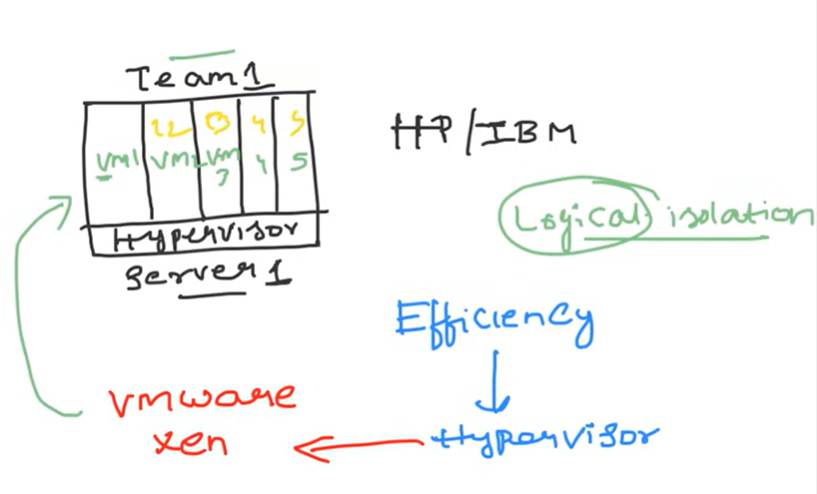
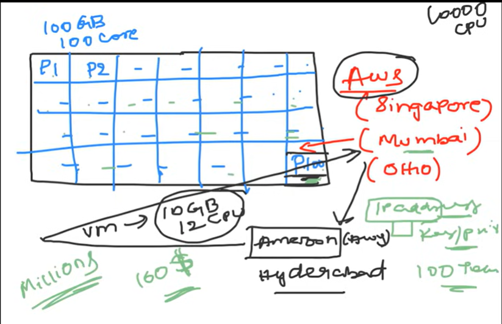

### Virtual Machines

- The main objective of the Devops Engineers is to improve the efficiency and use of all resources.

- In general, Dev teams used to built the applications in the local system and servers are the things they used to deploy their applications for clients

- To avoid the inefficiency the concept of virtualization comes into picture.

- Hypervisor is the software we install in the server to create the virtual machines and assign the each VM to the teams to increase the efficiency.

- VMware,Xen are some of the examples of Hypervisors

- In AWS VM is called as Ec2 instance.

