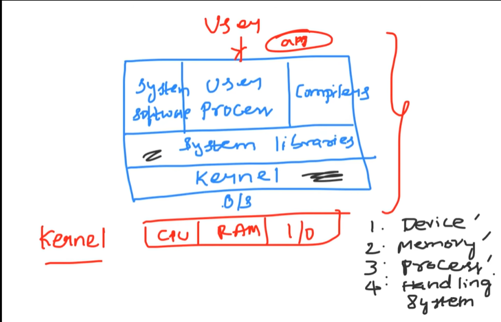

### Key components of server
## Hardware
- CPU
- RAM
- IO

## Software
- Jenkins
- Java / Python

## Operating system acts as an interface between hardware and software

## Why linux is popular?

- linux is free operating system (opensource) whereas windows is owned by microsoft
- linux is more secure 
- It has more distributions like ubuntu
- It is very fast

- kernel is the heart of the operating system
- It performs 4 important tasks(Device,Memory,Process,Handling system management)

### Linux

- terminal emulator(terminal) we can control the operating system

- Downloaded WSL and Ubuntu to practice the linux commands

- cd ~ takes us to the home directory

### Fundamentals of Shell Scripting

- Shell is the command-line way we talk to the operating system
- Shell commands are very helpful to communicate to linux operating system

## Why we dont install GUI on linux servers?
- Again it will create an unnecessary weight on the server

- We can use the wsl or mobaxterm for terminal
- We can use the shell as bash (for administration purpose)

