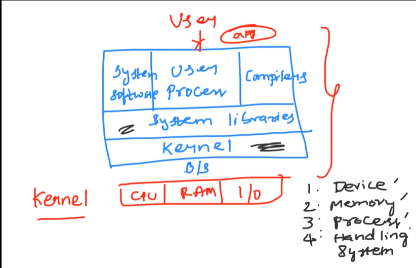
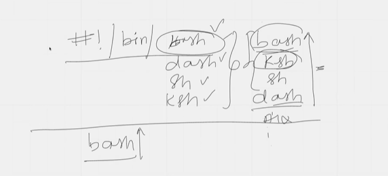
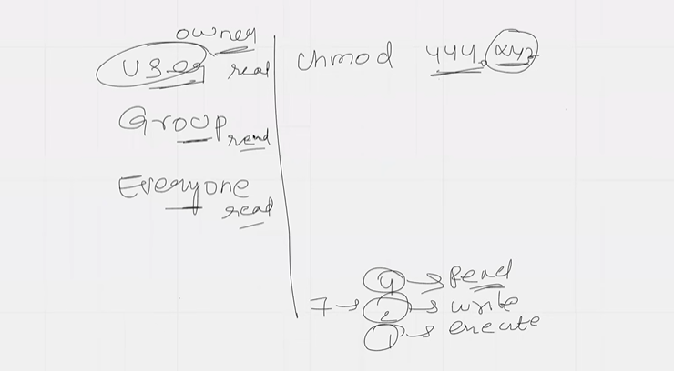
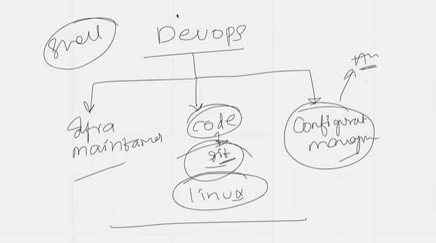

### Key components of server
## Hardware
- CPU
- RAM
- IO

## Software
- Jenkins
- Java / Python

## Operating system acts as an interface between hardware and software

## Why linux is popular??

- linux is free operating system (opensource) whereas windows is owned by microsoft
- linux is more secure 
- It has more distributions like ubuntu
- It is very fast

- kernel is the heart of the operating system
- It performs 4 important tasks(Device,Memory,Process,Handling system management)

### Linux

- terminal emulator(terminal) we can control the operating system

- Downloaded WSL and Ubuntu to practice the linux commands

- bash is by default installed with wsl

- cd ~ takes us to the home directory

- pwd means present working directory

- ls gives the list of files present in the working directory

- if we want to move forward type cd

- if we want to move backward type cd ..

- ls -ltr gives the entire information about the directory with time stamps who created it, how many files and folders it contains

- man is used as manual for any command

- touch is used to create the file but we cant write something inside the file

- but by using vi we can create and also write something inside the file

- we insert enter i to go insert mode

- type our required content and enter escape and type : then

- wq! to save the file

- cat is used to print the content in the file

- mkdir we can create the directory

- rm we can file

- rm -r we can remove the directory

- to check the memory usage we use free command

- to check the cpu usage we use nproc command

- to check the disc usage we use free command

- All we can see in the top command

### Fundamentals of Shell Scripting

- Shell is the command-line way we talk to the operating system
- Shell commands are very helpful to communicate to linux operating system

## Why we dont install GUI on linux servers?
- Again it will create an unnecessary weight on the server

- We can use the wsl or mobaxterm for terminal
- We can use the shell as bash (for administration purpose)

## Shell Scripting is nothing bu the process of automation of tasks in our linux machine

## How to write Shell Scripting?

- #!/ is called as Shebang

- | is called the pipe command

- sends the output of the first command to the input of the second command

- Best practices before writing the shell scripting
- set -x #is used for debug mode
- set -e #is used to spot the error
- set -o pipefail 

- ps -ef is used to extract all the processes running

- grep is used to exract the particular process

- awk it is powerful command which can helps to retrieve the exact part of the line

- curl logfile | grep ERROR (it doesnot download the log file)

- wget logfile | grep ERROR (it download the logfile)

- sudo su - (it gives the root user access)

- find is the command used to find the location of the file

